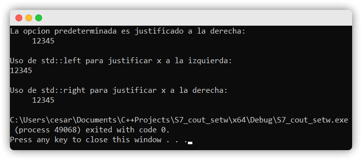

# PUNTO DE CONTROL 6

## :copyright: Autor

- :camera: 

- :man: **Cesar Augusto Núñez Medina**
- :e-mail: cesar23augusto16@gmail.com

---

## :dart: Objetivos

1. :nut_and_bolt: La diferencia en el uso de:
   - **static_cast** 
   - **dynamic_cast**
   - **reinterpret_cast** 
2. :books: La utilización de: 
    - `.h` (declaración)
    - `.cpp` (implementación)
3. :mag: La optimización de:
   - `#include` (mínimo requerido)
   - `using namespace std` (solo cuando se necesita)
4. :open_file_folder: La organización de:
   - Código (**Visual Studio Code**)
   - Imágenes (Extensión **Polacode** de **VSC**)
   - Formato, Diagrama y Emojis (**Markdown** en **VSC**)
5. :pencil2: Formatear y Validar:
   - Entrada de flujos
   - Salida de flujos
6. :memo: Utilización de archivos:
   - De texto
   - Binarios

## :black_circle: S7_eofPut.cpp 

Uso de cin.eof() (End Of File)

 

---

## :white_circle: S7_cinCinGet.cpp

Uso de cin.get()

 

---

## :black_circle: S8_cinGetline.cpp

Uso de cin.getline()

---

## :black_circle: S7_readWrite.cpp

Uso de cin.read() y cin.write() para leer un número n de bytes, y uso de cin.gcount()

---

## :white_circle: S7_dect_oct_hex_Setbase.cpp

Uso de hex, dec y oct, de std para manipular un número decimal

---

## :black_circle: S7_cmath_iomanip.cpp

Uso de cout.precision() para especificar la cantidad de digitos significantes que desean mostrarse.

---

## :white_circle: S7_cout_width.cpp

Uso de cout.width() que representa el mínimo de carácteres que deben ser mostrados.

Uso de cout.fill() para llenar los espacios sin rellenar con un carácter específico.

---

## :black_circle: S7_cout_setw.cpp

Uso de setw() para modificar el ancho de la operacion siguiente.

---

## :white_circle: S8_JustificacionCharRelleno.cpp

Justificar un texto con diferentes manipuladores de flujo.

---

## :black_circle: S8_scientific_y_fixed.cpp

Usar scientific y fixed para cambiar la manera en que se muestra un número.

---

## :white_circle: S8_ascii.cpp

Utilizar el tipo de dato bitset para almacenar bits, que contengan un objeto que almacena un número binario.

Usar el método to_string de ese objeto binario para transformar ese número en binario a una cadena.

---

## :black_circle: S8_Archivos1.cpp

Uso de la librería fstream para escribir en archivos con un objeto de tipo ofstream.

---

## :white_circle: S8_Archivos_entrada.cpp

Uso de la librería fstream para leer un archivo con un objeto de tipo ifstream.

---

## :black_circle: Contacto.h

Declaración de los miembros de la clase Contacto.

---

## :white_circle: Contacto.cpp

Definición de funciones de la clase Contacto.

---

## :black_circle: S8_Acceso_Aleatorio_.cpp

Uso de reinterpret_cast<>() que permite castear un puntero a otro puntero de cualquier tipo.

Manejo de archivos binarios y uso de métodos como:

  * seekp(pos): establece la posición en bits del siguiente caracter que se desea manipular.
  * read(): leer una cantidad de bits en una cadena.
  * write(): escribe una cadena en el archivo binario.

---

## :white_circle: S8_Acceso_Aleatorio_V2.cpp

Programa de acceso aleatorio modificado, incluyendo una nueva clase en un archivo .cpp y .h para realizar las operaciones.

Incluye la completación del código para que se modifique el registro número 3.

---

## :white_circle: Operaciones.cpp

---

## :white_circle: Operaciones.h

---

## :black_circle: Contacto.h

---

## :white_circle: Contacto.cpp

---
---

## :black_circle: Salida - S7_eofPut.cpp

---

## :white_circle: Salida - S7_cinCinGet.cpp

---

## :black_circle: Salida - S8_cinGetline.cpp

---

## :black_circle: Salida - S7_readWrite.cpp

---

## :white_circle: Salida - S7_dect_oct_hex_Setbase.cpp

---

## :black_circle: Salida - S7_cmath_iomanip.cpp

---

## :white_circle: Salida - S7_cout_width.cpp

---

## :black_circle: Salida - S7_cout_setw.cpp

---

## :white_circle: Salida - S8_JustificacionCharRelleno.cpp

---

## :black_circle: Salida - S8_scientific_y_fixed.cpp

---

## :white_circle: Salida - S8_ascii.cpp

.png)
.png)
.png)
.png)
.png)
.png)

---

## :black_circle: Salida - S8_Archivos1.cpp

---

## :white_circle: Salida - S8_Archivos_entrada.cpp

---

## :black_circle: Salida - S8_Acceso_Aleatorio_.cpp

---

## :white_circle: Salida - S8_Acceso_Aleatorio_V2.cpp

---

#### Herramientas:
- :package: [Visual Studio Code](https://code.visualstudio.com/)
- :camera: [Polacode-2020 v0.5.2](https://github.com/jeff-hykin/polacode)
- :notebook: [Markdown Cheatsheet](https://github.com/adam-p/markdown-here/wiki/Markdown-Cheatsheet)
- :smile: [Emoji Cheat Sheet](https://www.webfx.com/tools/emoji-cheat-sheet/)
